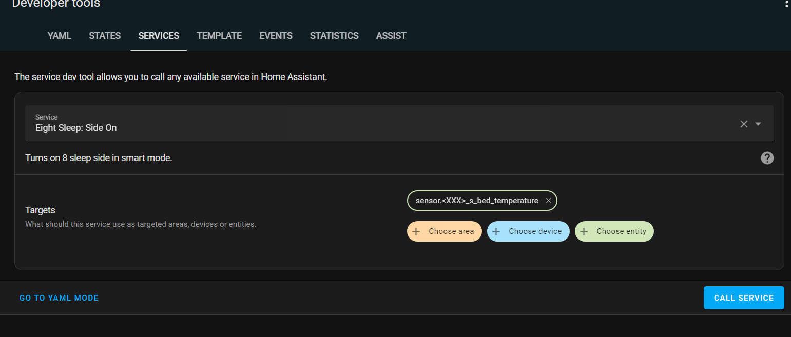
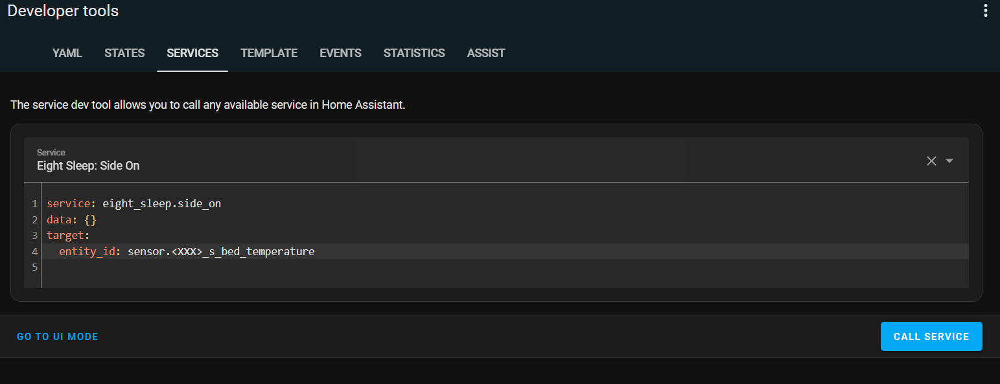

# Eight Sleep Integration for Home Assistant

Home Assistant Eight Sleep integration that works with Eight Sleep's V2 API and OAUTH2

## Installation
### HACS

1. Add this repository to HACS *AS A CUSTOM REPOSITORY*.
2. Search for *Eight Sleep*, and choose install. 
3. Reboot Home Assistant and configure from the "Add Integration" flow.

NOTE: Ensure neither side is in away mode when setting up the Eight Sleep integration.

## Prerequisites ##
### Authentication ###
 

To get the OAuth2 login to work you need:
- user email
- user password

UPDATE: You now only need your user name and password for Eight Sleep's current OAuth2 implementation. If you don't have your client_id and/or client_secret, leave those values blank when setting up the integration.
<strike>

- client_id
- client_secret

To get the client_id and client_secret you can setup a packet capture and a mitm CA to get the unencrypted traffic from your app. You can also decompile the APK to get the values.

The process I used was:
- Open pcapdroid and install PCAPDroid mitm
- download and install rootAVD https://github.com/newbit1/video-files/blob/master/rootAVD_Windows.gif 
  - 2 ways to root an AVD (android studio); Magisk (rootAVD) and SuperSU
- Should auto install magisk
- Run the avd root install steps then open a cmd in ..\rootavd\rootAVD
- Install the mitm cert (mitmproxy-ca-cert.cert)
- https://emanuele-f.github.io/PCAPdroid/tls_decryption the MagiskTrustUserCerts module, and then install the hashed certificate (replace mitmproxy-ca-cert.cer with the PCAPdroid certificate name) as a system certificate. 	
- Run the app and capture date in pcapdroid. 
  - Make sure you capture the data during an app login session. The data should be in the POST request from the app to auth-api.8slp.net.~~</strike>

## Usage ##
The integration will function similarly to the previous Home Assistant core Eight Sleep integration. It will import the Eight Sleep bed sides and account as devices.
 Setting the temperature on the bed is between a -100 to 100 range. This range is unit-less in the API.

There are a few services you can use on the <..>_bed_temperature entities:
- **Heat Set**
  - Sets heating/cooling level for a <..>_bed_temperature entity.
- **Heat Increment**
  - Increases/decreases the current heat level for a <..>_bed_temperature entity.
- **Side Off**
  - Turns off 8 sleep side. Input entity must be a <..>_bed_temperature entity.
- **Side On**
  - Turns on 8 sleep side in smart mode. Input entity must be a <..>_bed_temperature entity.
- **Alarm Snooze**
  - Snoozes an _active_ alarm on a <..>_bed_temperature entity for a specified number of minutes.
- **Alarm Stop**
  - Stops an _active_ alarm on a <..>_bed_temperature entity.
- **Alarm Dismiss**
  - Dismisses an _upcoming_ alarm on a <..>_bed_temperature entity. 
- **Start Away Mode**
  - Turns on away mode for an 8 sleep side. Input entity must be a <..>_bed_temperature entity.
- **Stop Away Mode**
  - Turns off away mode for an 8 sleep side. Input entity must be a <..>_bed_temperature entity.
- **Prime Pod**
  - Will start the bed priming. Input entity must be a <..>_bed_temperature entity. The user side that calls this service is the one that will be notified when it is finished.
- **Set Bed Side**
  - Will set the bed side for the user selected by the <..>_bed_temperature entity as the target. The options are "Both", "Left", or "Right". While the app has an option to set "Away" for the bed side, the API call does not work like that. If you would like to set away status, use the "Start Away Mode" or "Stop Away Mode" service calls.

 
**Example Service Calls**

   

There are a few possible sensor values for each Eight Sleep side. Some ones with caveats are
- **Bed Presence**
  - Presence is calculated retroactively by Eight Sleep and is not reliable.
  For example leaving the bed for an hour does not end the presence.
  The lack of heart rate measurement is used instead to determine presence with a smaller delay.
- **Next Alarm**
  - This will be the datetime value of your next alarm. If you have no alarms set, then it will be set to Unknown.

| Entity                  | Owner | Type        | Reliable | Notes                                                                                                                                                                                           |
|-------------------------|-------|-------------|----------|-------------------------------------------------------------------------------------------------------------------------------------------------------------------------------------------------|
| Has Water               | Bed   | Boolean     | Yes      |                                                                                                                                                                                                 |
| Is Priming              | Bed   | Boolean     | Yes      |                                                                                                                                                                                                 |
| Last Prime              | Bed   | Datetime    | Yes      |                                                                                                                                                                                                 |
| Needs Priming           | Bed   | Boolean     | Yes      |                                                                                                                                                                                                 |
| Room Temperature        | Bed   | Temperature | Yes      |                                                                                                                                                                                                 |
| Bed Presence            | Side  | Presence    | Sort Of  | Uses heart rate sensors to detect presence.                                                                                                                                                     |
| Bed State               | Side  | Percent     | Sort Of  | This value is pulled directly from the API and relates to the target heating level. While it may not seem to relate to anything, some people are able to use it to correlate a bed presence to. |
| Bed State Type          | Side  | String      | Yes      | Options are: "off", "smart:bedtime", "smart:initial", "smart:final"                                                                                                                             |
| Bed Temperature         | Side  | Temperature | Yes*     | Only accurate when the pod is on.                                                                                                                                                               |
| Target Temperature      | Side  | Temperature | Yes      | The target temperature for the bed side in degrees.                                                                                                                                             |
| Breath Rate             | Side  | Measurement | Yes      |                                                                                                                                                                                                 |
| Heart Rate              | Side  | Measurement | Yes      |                                                                                                                                                                                                 |
| HRV                     | Side  | Measurement | Yes      |                                                                                                                                                                                                 |
| Next Alarm              | Side  | Datetime    | Yes      | The alarm ID is available as an attribute on the sensor.                                                                                                                                        |
| Presence End            | Side  | Datetime    | Yes      |                                                                                                                                                                                                 |
| Presence Start          | Side  | Datetime    | Sort Of  | This is continuously updated during an active sleep session                                                                                                                                     |
| Sleep Fitness Score     | Side  | Measurement | Yes      |                                                                                                                                                                                                 |
| Sleep Quality Score     | Side  | Measurement | Yes      |                                                                                                                                                                                                 |
| Routine Score           | Side  | Measurement | Yes      |                                                                                                                                                                                                 |
| Sleep Stage             | Side  | String      | **No**   |                                                                                                                                                                                                 |
| Time Slept              | Side  | Duration    | Yes      |                                                                                                                                                                                                 |
| Side                    | Side  | String      | Yes      | The current side that this user side is set to                                                                                                                                                  |

Sensor values are updated every 5 minutes

When the Base is installed, the following entities are available:

| Entity | Type | Notes |
|---|---|---|
| Snore Mitigation | Boolean | Indicates that the snore mitigation is active, raising the head |
| Feet Angle | Number | Can be changed from the UI |
| Head Angle | Number | Can be changed from the UI |
| Base Preset | Select | The app currently offers three presets for the base: sleep, relaxing, and reading. |

These values are updated every minute.

## TODO ##
- Translate "Heat Set" and "Heat Increment" values to temperature values in degrees for easier use.
- Add device actions, so they can be used instead of service calls.
- Add local device functionality for jailbroken devices using the steps in https://github.com/bobobo1618/ninesleep
- Add icons.json file

## FAQS ##
- Can I use this integration without an Eight Sleep subscription?
  - I believe you can use this integration without a subscription. This integration uses the same calls as the app. And I believe the app allows the calls the integration is using, even when not having a subscription.
I don't have any way to test it out though, because I have a grandfathered account.
- Can I use this integration to get a reliable, current bed presence?
  - No. Presence is calculated retroactively by Eight Sleep based on sensor data. It's neither reliable, nor real-time.
### Credits ###
Thanks to @mezz64 and @raman325 for developing the previous Eight Sleep integration.

This is also based on work from https://github.com/lukas-clarke/pyEight and I will likely maintain this repo over the aforementioned one.

